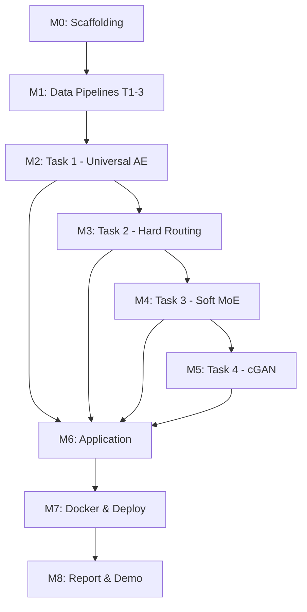

# GenAI Assignment #1 — Master Project Plan

## Overview

Build four generative AI systems integrated into one cohesive web application:

| Task | Model | Dataset | Key Output |
|------|-------|---------|------------|
| **T1** | Universal Denoising Autoencoder | Oxford-IIIT Pet | Single AE restoring 3 corruption types + clean |
| **T2** | Hard-Routed Specialist AEs | Oxford-IIIT Pet | Classifier → 3 specialist AEs + identity bypass |
| **T3** | Soft Mixture-of-Experts | Oxford-IIIT Pet | Gating network + weighted expert blend |
| **T4** | Conditional GAN (Face→Sketch) | FS2K | U-Net generator + PatchGAN discriminator |

**Stack**: PyTorch · Optuna · MLflow/W&B · ONNX · FastAPI · React + Tailwind · Docker Compose

---

## Milestone 0: Project Scaffolding & Shared Infrastructure
**Goal**: Set up repo structure, dev environment, and all shared utilities.

### Deliverables
- [x] Repository structure
- [x] `pyproject.toml` / `requirements.txt` with pinned deps
- [x] Shared corruption pipeline (`src/data/corruptions.py`)
- [x] Dataset download & preparation scripts
- [x] Deterministic validation/test corruption manifests
- [x] Config system (YAML or Hydra)
- [x] MLflow/W&B integration boilerplate
- [x] SSIM loss utility
- [x] Common training loop utilities (early stopping, checkpointing, LR scheduling)
- [x] ONNX export helper

### Key Decisions
- **128×128** image resolution for all tasks
- **Random seed 42** everywhere
- Oxford-IIIT Pet: 80/20 train/val split
- FS2K: Official train/test + 15% stratified val from train

---

## Milestone 1: Data Pipelines (Tasks 1-3)
**Goal**: Fully working data loaders for Tasks 1–3.

### M1.1 — Oxford-IIIT Pet Pipeline
- [x] Download Oxford-IIIT Pet dataset
- [x] 80/20 split with seed 42
- [x] Runtime corruption pipeline (clean / salt-and-pepper / blur / occlusion)
  - Salt-and-pepper: p ∈ [0.02, 0.15]
  - Gaussian blur: kernel ∈ {3,5,7}, σ ∈ [0.5, 2.5]
  - Occlusion: 1–3 rectangles, 10–35% area
- [x] Deterministic **validation manifest** (fixed corruptions per image)
- [x] Deterministic **test manifest** with 3 severity levels per corruption:
  - S&P: p = {0.03, 0.08, 0.15}
  - Blur: {(3,0.7), (5,1.5), (7,2.5)}
  - Occlusion: ~{10%, 20%, 35%} with {1, 2, 3} rectangles
- [ ] Balanced batching support (for classifier in T2)

---

## Milestone 2: Task 1 — Universal Denoising Autoencoder
**Goal**: Train a single AE that restores all corruption types.

### M2.1 — Architecture
- [ ] Conv encoder (progressive spatial reduction, channel increase)
- [ ] Genuine bottleneck (compressed latent)
- [ ] Conv decoder (reconstruct 128×128 RGB)
- [ ] Optional limited skip connections (must be justified)

### M2.2 — Training
- [ ] Combined loss: `L = α·L1(x, x̂) + (1-α)·(1 - SSIM(x, x̂))`
- [ ] Initial α = 0.8
- [ ] Log train/val losses to MLflow/W&B
- [ ] Checkpoint best model by val loss

### M2.3 — Optuna Hyperparameter Search
- [ ] Search space: learning rate, batch size, bottleneck dim, encoder channels, dropout, α
- [ ] Validation objective = reconstruction quality + SSIM
- [ ] Report: search space, trial count, best trial, final config

### M2.4 — Evaluation
- [ ] Per-corruption-type metrics (clean, S&P, blur, occlusion)
- [ ] Per-severity-level metrics (low, medium, high)
- [ ] Visual grid: clean target | corrupted input | reconstruction | error map
- [ ] ≥12 representative examples + ≥4 failure cases

### M2.5 — ONNX Export
- [ ] Export trained model to ONNX
- [ ] Verify ONNX output matches PyTorch output

---

## Milestone 3: Task 2 — Corruption Classifier & Hard-Routed Specialists
**Goal**: Classifier → specialist AE routing system.

### M3.1 — Corruption Classifier
- [ ] Conv classifier → 4 classes (clean, S&P, blur, occlusion)
- [ ] Balanced training batches
- [ ] Cross-entropy loss
- [ ] Optuna: LR, batch size, channels, dropout, weight decay
- [ ] Evaluation: accuracy, macro precision/recall/F1, per-class metrics, confusion matrix

### M3.2 — Specialist Autoencoders (×3)
- [ ] Salt-and-pepper specialist
- [ ] Gaussian blur specialist
- [ ] Rectangular occlusion specialist
- [ ] Same architecture base, independent weights
- [ ] Optuna (shared search → independent training): LR, bottleneck, channels, batch size, L1/SSIM weight
- [ ] Clean → identity bypass (no specialist needed)

### M3.3 — Hard-Routed Inference
- [ ] Oracle-routing mode (ground-truth label selects expert)
- [ ] Predicted-routing mode (classifier selects expert)
- [ ] Compare both modes
- [ ] Identify classifier-error-induced restoration failures

### M3.4 — ONNX Export
- [ ] Export classifier + 3 specialists to ONNX
- [ ] Verify consistency

---

## Milestone 4: Task 3 — Soft Mixture-of-Experts
**Goal**: Transform hard routing into differentiable soft MoE.

### M4.1 — Gating Network
- [ ] Takes corrupted image → 4 routing weights via softmax with temperature τ
- [ ] `w = softmax(G(x̃)/τ)` → [w_clean, w_salt, w_blur, w_occlusion]
- [ ] Initialize from trained classifier (M3)

### M4.2 — Soft Fusion
- [ ] `x̂ = w₁·x̃ + w₂·A_salt(x̃) + w₃·A_blur(x̃) + w₄·A_occlusion(x̃)`
- [ ] Initialize experts from Task 2 specialists

### M4.3 — Joint Training
- [ ] **Stage 1 — Warm-up**: Freeze experts, train gate only
- [ ] **Stage 2 — Joint fine-tuning**: Unfreeze all, smaller LR
- [ ] Joint loss: `L = λ₁·L1 + λ₂·(1-SSIM) + λ₃·L_CE + λ₄·L_balance`
- [ ] Balance loss: `L_balance = Σ(w̄_k - 1/4)²`
- [ ] Initial: λ₁=0.8, λ₂=0.2, λ₃=0.1, λ₄=0.01

### M4.4 — Optuna
- [ ] Search: joint LR, temperature τ, classification weight, balance weight, reconstruction weight
- [ ] Pruning on routing collapse

### M4.5 — Evaluation
- [ ] Reconstruction quality vs Task 1 and Task 2
- [ ] Average expert weights per corruption type × severity
- [ ] Routing heatmap / weight-distribution diagrams
- [ ] Examples: single expert dominance vs distributed weights
- [ ] Check for inactive experts or over-dominant expert

### M4.6 — ONNX Export
- [ ] Export complete soft MoE pipeline to ONNX

---

## Milestone 5: Task 4 — Conditional GAN (Face→Sketch)
**Goal**: Style-conditioned pix2pix for face-to-sketch generation.

### M5.1 — FS2K Pipeline
- [ ] Download FS2K dataset
- [ ] Use official train/test definitions
- [ ] 15% stratified validation split from training (seed 42)
- [ ] Paired transforms (identical spatial augmentation for photo+sketch)
- [ ] Resize to 128×128
- [ ] Style label loading (3 categories)

### M5.2 — Generator (U-Net)
- [ ] Encoder-decoder with skip connections
- [ ] Input: photo + style condition (learned embedding for 3 FS2K styles)
- [ ] Output: generated sketch (128×128)

### M5.3 — Discriminator (PatchGAN)
- [ ] Receives: (photo, sketch, style_embedding)
- [ ] Classifies local patches as real/fake

### M5.4 — Training
- [ ] Generator loss: `L_G = L_adv + λ_L1 · L1(y, G(x,s))`
- [ ] Discriminator loss: BCE with logits on real vs fake
- [ ] Initial λ_L1 = 100
- [ ] Log: D_real loss, D_fake loss, G_adv loss, G_recon loss, val metrics
- [ ] Log sample generations at fixed intervals (same val photos)

### M5.5 — Optuna
- [ ] Search: G_lr, D_lr, batch size, base channels, dropout, embedding dim, λ_L1
- [ ] Reduced epoch trials → full retrain with best config

### M5.6 — Evaluation
- [ ] Side-by-side: photo | generated sketch | ground truth
- [ ] Per-style results
- [ ] FID or other GAN metrics if feasible

### M5.7 — ONNX Export
- [ ] Export generator only to ONNX

---

## Milestone 6: Application (React + FastAPI)
**Goal**: Unified web app with 4 workspaces.

### M6.1 — UI Design in Google Stitch
- [ ] Design all 4 workspace layouts
- [ ] Capture screenshots for report

### M6.2 — FastAPI Backend
- [ ] Health-check endpoint (`/health`)
- [ ] `/api/universal-restore` — Task 1 inference
- [ ] `/api/hard-route` — Task 2 inference (returns classifier probs + expert selection + result)
- [ ] `/api/soft-mixture` — Task 3 inference (returns 4 routing weights + result)
- [ ] `/api/face-to-sketch` — Task 4 inference (accepts style selection)
- [ ] ONNX model loading & session management
- [ ] File upload validation & preprocessing
- [ ] Timing info in all responses

### M6.3 — React + Tailwind Frontend
- [ ] Navigation between 4 workspaces
- [ ] **Workspace 1 — Universal Restoration**: Upload/select image → apply corruption → restore → show input, output, settings, inference time
- [ ] **Workspace 2 — Hard-Routed Restoration**: Show classifier probs, predicted corruption, selected expert, reconstruction, inference time
- [ ] **Workspace 3 — Soft MoE Restoration**: Show 4 routing weights, visual expert contribution, reconstruction, inference time
- [ ] **Workspace 4 — Face-to-Sketch Generator**: Upload/webcam → select style (1/2/3) → generate → side-by-side display → download
- [ ] Responsive layout

---

## Milestone 7: Docker & Deployment
**Goal**: One-command local deployment via Docker Compose.

- [ ] `Dockerfile` for backend (Python + ONNX Runtime + FastAPI)
- [ ] `Dockerfile` for frontend (Node build → nginx serve)
- [ ] `docker-compose.yml` with both services
- [ ] Volume mount or download script for ONNX models
- [ ] README with complete execution instructions
- [ ] Verify: clone → get models → `docker compose up` → browser access

---

## Milestone 8: Report & Demo Video
**Goal**: IEEE-format LaTeX report + 5–7 min YouTube demo.

### Report Sections
- [ ] Problem introduction
- [ ] Related work
- [ ] Dataset preparation (corruption configs, splits, manifests)
- [ ] Architecture design (per task) + diagrams
- [ ] Loss functions (per task)
- [ ] Training procedure
- [ ] Optuna search design + results
- [ ] Experimental results (per task):
  - Quantitative tables
  - Training/validation curves
  - Confusion matrices (T2)
  - Routing heatmaps (T3)
  - Generated image grids (T4)
  - Error maps
  - Failure cases
- [ ] Application architecture + Stitch screenshots
- [ ] Limitations
- [ ] Conclusion
- [ ] AI-use appendix

### Demo Video (5–7 min, YouTube)
- [ ] App startup (docker compose)
- [ ] Task 1: upload → corrupt → restore
- [ ] Task 2: upload → classify → route → restore
- [ ] Task 3: upload → soft routing weights → restore
- [ ] Task 4: upload/webcam → select style → generate sketch → download
- [ ] Show W&B/MLflow records

---

## Dependency Graph

> [!IMPORTANT]
> Tasks 1→2→3 are sequential (each builds on the previous). Task 4 is independent and can be worked on after Tasks 1-3.
