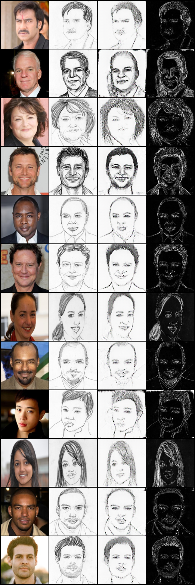
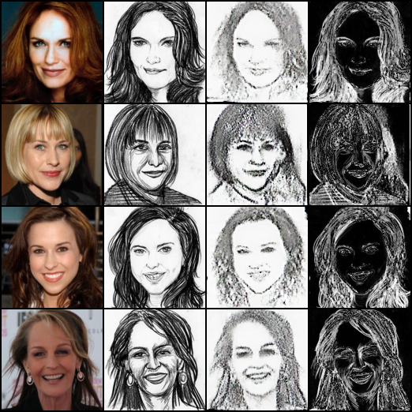

# Task 4: Face-to-Sketch Conditional GAN Evaluation Report

## Quantitative Metrics (Test Set)

The final generator model (`generator_final.pth`) was evaluated on the isolated official test set. 
The following perceptual and reconstruction metrics were recorded for each of the 3 style categories:

| Style | Image Count | L1 Loss | SSIM | PSNR |
| :---: | :---: | :---: | :---: | :---: |
| **Style 0** | 619 | 0.0806 | 0.5358 | 17.0952 |
| **Style 1** | 381 | 0.1525 | 0.3926 | 12.4160 |
| **Style 2** | 46 | 0.0642 | 0.6371 | 18.6113 |

*Note: The test set split heavily favors Style 0 and Style 1. Style 2 has the fewest examples but achieved the best reconstruction metrics overall.*

---

## Qualitative Analysis

Visual grids have been generated to assess the perceptual quality of the generated sketches. The grid columns are organized as follows:
**Photo | Ground-Truth Target Sketch | Generated Sketch | L1 Error Map**

### 1. Representative Examples
**Criteria:** To ensure we don't cherry-pick the absolute best examples, we use Reservoir Sampling to select exactly 12 *uniformly random* candidates that fall under an acceptable L1 loss threshold (`L1 < 0.20`). This provides a realistic cross-section of the model's typical performance across all styles.

### 2. Failure Cases
**Criteria:** The failure cases are determined objectively by tracking the 4 generated images with the **highest absolute L1 error** across the entire test set. These represent the worst-case scenarios for the model.

